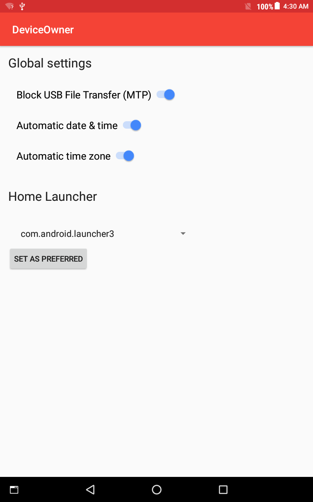

DEMO OF LENOVO TB3-850M CRASH WHEN BLOCKING MTP_USB
===================================

Introduction
------------

A simple app to reproduce the boot-loop issue on Lenovo TB3-850M (build TB3-850M_S100036_171214_ROW) when the DevicePolicyManager enforces [DevicePolicyManager.addUserRestriction(admin, "no_usb_file_transfer")](https://developer.android.com/reference/android/app/admin/DevicePolicyManager#addUserRestriction(android.content.ComponentName,%20java.lang.String)) to prevent MTP file transfer usage.

Calling DevicePolicyManager.addUserRestriction(admin, "no_usb_file_transfer") actually stops the MTP feature on the device, but after that point whenever the device is shutdown it will not restart (boot-loop). 
A hard reset (POWER+ Vol-Down, then option "eMMC") of the tablet brings it back to life.

How to use
------------

* Build the app (or use the [APK provided here](apk/demo.apk))
* Install on the target tablet. The tablet MUST BE WITHOUT ANY ACCOUNT INSTALLED, so the app can be set as DeviceOwner. If there is an account setup on the tablet (Google account for example), just do a factory reset first and install the APK just after.
* Set the sample app as DeviceOwner using adb:
```
adb shell dpm set-device-owner com.example.android.deviceowner/.DeviceOwnerReceiver
```

* Start the app ("DeviceOwner") and block USB File Transfer:
 

* Reboot.


Based on the sample by Google, with just a few lines added to add the feature "no_usb_file_transfer restriction":

Android DeviceOwner Sample
===================================

This sample demonstrates how to use some device owner features. As a device owner, you can configure
global settings such as automatic time and timezone. You can mandate a specific launcher by
preferred intent handler.

Introduction
------------

In order to set global settings, use [DevicePolicyManager#setGlobalSetting][1] and specify one of
the [Settings.Global][2] keys available. Note that you need to specify its value as a String. As
most of the keys accept boolean values, you will mostly use "1" for true and "0" for false.

You can mandate a specific launcher by adding a persistent preferred activity for an IntentFilter
with Intent.CATEGORY_HOME category. Call [DevicePolicyManager#addPersistentPreferredActivity][3] to
register the activity. You can clear the registration with
[clearPackagePersistentPreferredActivities][4].

As a device owner, you can also use the features available for managed profile owner. See
[BasicManagedProfile][5].

[1]: http://developer.android.com/reference/android/app/admin/DevicePolicyManager.html#setGlobalSetting(android.content.ComponentName, java.lang.String, java.lang.String)
[2]: http://developer.android.com/reference/android/provider/Settings.Global.html
[3]: http://developer.android.com/reference/android/app/admin/DevicePolicyManager.html#addPersistentPreferredActivity(android.content.ComponentName, android.content.IntentFilter, android.content.ComponentName)
[4]: http://developer.android.com/reference/android/app/admin/DevicePolicyManager.html#clearPackagePersistentPreferredActivities(android.content.ComponentName, java.lang.String)
[5]: https://developer.android.com/samples/BasicManagedProfile/index.html

Pre-requisites
--------------

- Android SDK 27
- Android Build Tools v27.0.2
- Android Support Repository

Screenshots
-------------

 

Getting Started
---------------

This sample uses the Gradle build system. To build this project, use the
"gradlew build" command or use "Import Project" in Android Studio.

Support
-------

- Google+ Community: https://plus.google.com/communities/105153134372062985968
- Stack Overflow: http://stackoverflow.com/questions/tagged/android

If you've found an error in this sample, please file an issue:
https://github.com/googlesamples/android-DeviceOwner

Patches are encouraged, and may be submitted by forking this project and
submitting a pull request through GitHub. Please see CONTRIBUTING.md for more details.

License
-------

Copyright 2017 The Android Open Source Project, Inc.

Licensed to the Apache Software Foundation (ASF) under one or more contributor
license agreements.  See the NOTICE file distributed with this work for
additional information regarding copyright ownership.  The ASF licenses this
file to you under the Apache License, Version 2.0 (the "License"); you may not
use this file except in compliance with the License.  You may obtain a copy of
the License at

http://www.apache.org/licenses/LICENSE-2.0

Unless required by applicable law or agreed to in writing, software
distributed under the License is distributed on an "AS IS" BASIS, WITHOUT
WARRANTIES OR CONDITIONS OF ANY KIND, either express or implied.  See the
License for the specific language governing permissions and limitations under
the License.
